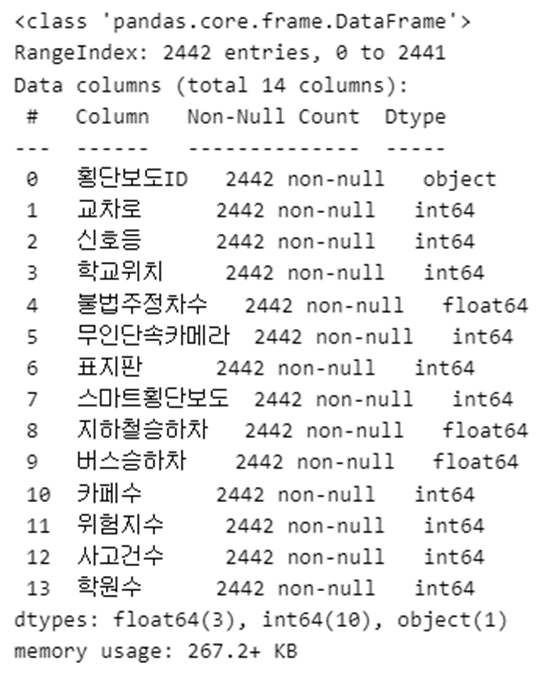
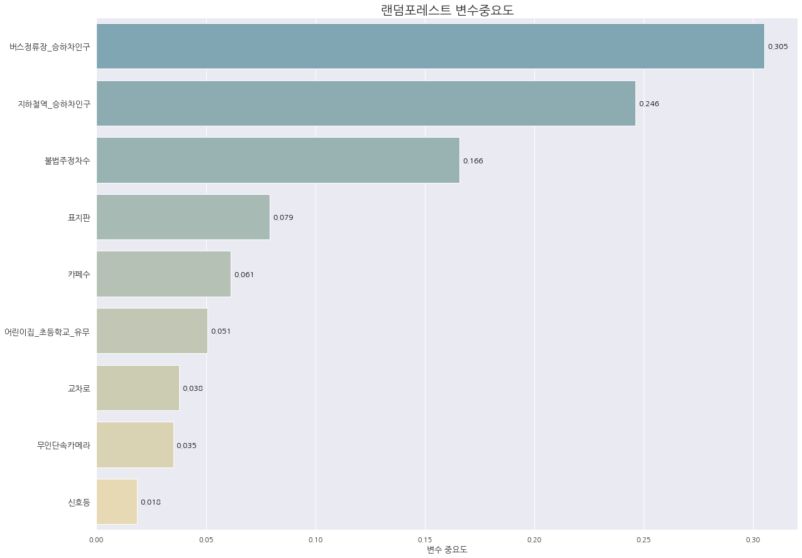
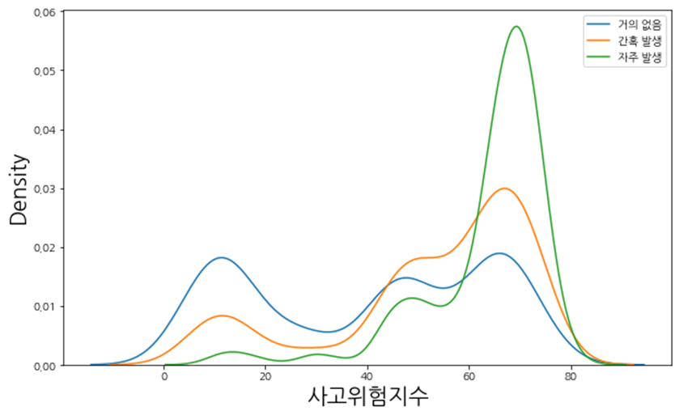
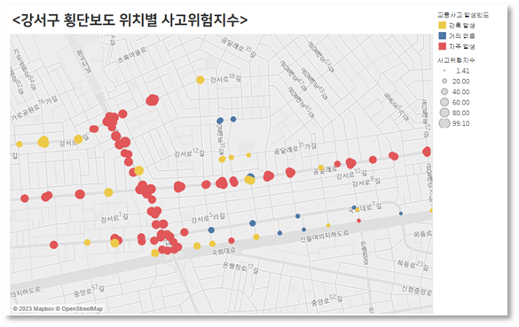
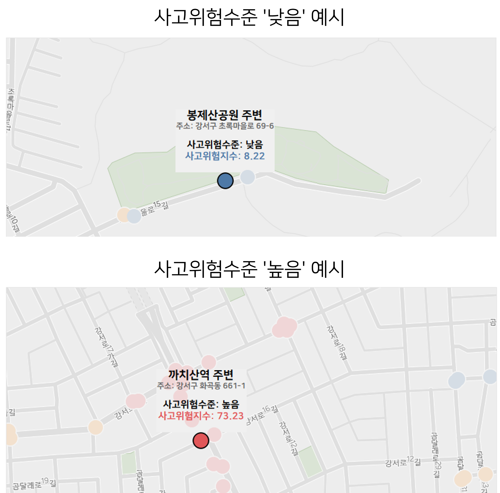
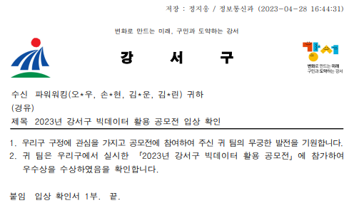

# 횡단보도 교통사고 위험지수 개발

---

교통사고 위험지수 개발을 통한 보행안전성 제고 방안 제안

멤버 : 손동현 (리더), 김나린, 김다운, 오지우

기간 : 2023.03 ~ 2023.04 (4주)

주최 : 강서구청

## My Role

- 논문 및 자료 조사 : 교통사고 예방 중요성 레퍼런스, 기존 교통안전지수 연구 확인, 강서구 교통사고 빈도 등 조사
- 데이터 수집 : 구급출동 사고 데이터, 지하철 위치 데이터, 지하철/버스 승하차 인원 정보,  카페 현황, 신호등 위치, CCTV 정보, 교차로 위치 데이터 수집
- 데이터별 전처리 : 데이터 통합 프로세스
- 회귀모형 모델링 : 모델링 및 변수 선택 진행
- 분류 모형 모델링 : 분류 모형 모델링
- 태블로 대시보드 시각화 : 대시보드로 맵에 사고위험지수 시각화
- PPT 발표자료 및 분석 보고서 작성
- 발표 자료 작성 및 발표 담당
- 프로젝트 서기 : 노션 회의, 분석 내용 정리

## 프로젝트 배경

- 지난 5년간 강서구청은 교통사건 발생건수 5위, 사망자수도 높은 순위를 유지하고 있음
- 보행자에게 교통위험수준을 전달하여 경각심을 부여하고 교통사고 발생을 줄이기 위해 분석을 수행하고자 함

## 주제 선정

- 기존의 교통안전지수는 지자체를 기준으로 교통안전도를 평가한 지수로, 세부적인 지역에 대한 지표는 존재하지 않았음
- 본 프로젝트에서는 강서구 내의 세부적인 지역에 따라서 교통사고 보행자 사고 위험을 나타내고자 함
- 일반적인 보행 사고의 50%는 횡단 중에 발생하여 횡단보도를 세부지역의 기준으로 사용하기로 하였음

### 분석목표

> 강서구 내의 횡단보도별 교통사고 위험수준 지표를 만들어 보행자의 보행안전성 제고
> 

## 데이터 셋

분석에 사용하기 위해 총 16개 데이터 셋 수집

1. [서울시 교통안전시설물 횡단보도 정보](https://data.seoul.go.kr/dataList/OA-15554/S/1/datasetView.do) (`횡단보도`)
    
    특징 - 횡단보도 위치 및 부착대 관련 위경도 데이터
    
2. [서울시 교통사고 구급출동 현황](https://www.bigdata-119.kr/goods/goodsInfo?goods_id=202302000054) (`사고건수`)
    
    특징 - 소방안전 빅데이터 플랫폼에서 제공하는 교통사고 구급출동 현황 데이터 위치정보
    
    - 심각성이 높은 수준의 교통사고 건수라고 볼 수 있음
3. [서울특별시 강서구 불법주정차 단속자료](https://www.data.go.kr/data/15099430/fileData.do) (`불법주정차 단속수`, `불법주정차`)
4. [서울특별시 강서구 스마트횡단보도 설치 현황](https://www.data.go.kr/data/15078522/fileData.do) (`스마트횡단보도`)
5. [전국무인교통단속카메라표준데이터](https://www.data.go.kr/data/15028200/standard.do) (`cctv`)
6. [서울시 교차로 관련 정보](https://data.seoul.go.kr/dataList/OA-15534/S/1/datasetView.do) (`교차로`)
7. 지하철 (`유동인구`)
    1. [서울교통공사_1_8호선 역사 좌표(위경도)](https://www.data.go.kr/data/15099316/fileData.do?recommendDataYn=Y)
    2. [국가철도공단_수도권9호선_역위치_20221117](https://www.data.go.kr/data/15041335/fileData.do)
    3. [서울시 지하철호선별 역별 승하차 인원 정보](https://data.seoul.go.kr/dataList/OA-12914/S/1/datasetView.do)
        
        역별 승하차 인원 정보 데이터
        
8. 버스정류장 (`유동인구`)
    1. [서울시 버스정류장 위치 정보](https://data.seoul.go.kr/dataList/OA-15067/S/1/datasetView.do)
    2. [서울시 버스노선별 정류소별 승하차 인원 정보](https://data.seoul.go.kr/dataList/OA-12912/S/1/datasetView.do)
        
        정류소별 승하차 인원 정보 데이터
        
9. [서울시 신호등 관련 정보](https://data.seoul.go.kr/dataList/OA-15546/S/1/datasetView.do) (`신호등`)
10. [서울특별시_강서구_어린이보호구역_20221121](https://www.data.go.kr/data/15012891/standard.do) (`주변학교유무`)
11. [서울시 안전표지 관련 정보](https://data.seoul.go.kr/dataList/OA-15540/S/1/datasetView.do) (`표지판`)
12. [서울특별시 강서구 카페 현황](https://www.data.go.kr/data/15098909/fileData.do?recommendDataYn=Y) (`카페`)
    
    도로명주소를 좌표로 변환하는 지오코딩을 수행하여 횡단보도별 50m, 100m 거리 내의 카페 수를 계산
    
13. [서울특별시 강서구 학원가 현황](https://open.neis.go.kr/portal/data/service/selectServicePage.do?page=1&rows=10&sortColumn=&sortDirection=&infId=OPEN15920190423094641415608&infSeq=1#none) (`학원가`)
    
    학원교습소현황 중 서울특별시 교육청에서 제공하는 강서구 학원가를 선정하여 도로명 주소를 좌표로 변환하고 횡단보도별 50m, 100m 거리 내 학원 수를 계산
    

## 기술 스택

- Python
- Tableau
- R
- pandas
- scikit-learn
- folium : 지도 시각화 패키
- pyproj : 위치 좌표 정보 변환 패키지

## 프로젝트 진행 단계

1. 분석 과제 결정 및 데이터 수집
2. 데이터별 전처리
3. 위치 데이터 통합
4. 회귀분석 및 변수 선택
5. 분류 모형 모델링
6. 사고위험지수 개발
7. 사고위험지수 타당성 확인
8. 대시보드 시각화
9. 활용방안 제안
10. 결과 정리 및 PPT 작성
11. 발표 자료 작성 및 발표

## 프로젝트 세부 과정

1. 분석 과제 결정 및 데이터 수집
    
    > 강서구 내의 횡단보도별 교통사고 위험수준 지표를 만들어 보행자의 보행안전성 제고
    > 
    - 데이터 수집
        
        **Problem 1** : 횡단보도별로 교통사고 건수, 시설물 등이 집계된 데이터가 존재하지 않는 문제
        
        → 위도 경도 좌표를 이용하여 횡단보도의 위경도로부터 교통사고 발생 위치까지의 거리를 계산하여 반경 50m 내에서 발생한 사고는 보행중 교통사고로 판단하기로 함
        
        기타 시설물 등과의 거리는 개별 데이터의 특성을 고려하여 직접 기준을 설정
        
        - 횡단보도로부터 거리 기준
            - 사고건수: 50m
            - 신호등: 5m
            - 교차로: 50m
            - CCTV:  200m
            - 어린이보호구역: 100m
            - 표지판: 10m
            - `카페`: 50m
            - `학원가`: 100m
            - 불법주정차 단속 위치: 100m - 겹치는 부분은 sum한 후 일평균으로 변환
            - 지하철역과 승하차인구 (18역)
                
                횡단보도별 가장 가까운 지하철 역의 승하차인구수를 기록하되,
                가장 가까운 지하철의 거리에 따라 가중치를 달리하여 반영.
                (가중치는 전체적인 지하철 거리 분포를 확인하고 산정)
                
                - 거리별 가중치
                    - 0m ~ 200m: 1.0
                    - 200m ~ 400m: 0.8
                    - 400m ~ 600m: 0.6
                    - 600m ~ 800m: 0.4
                    - 800m ~ 1000m: 0.2
                    - 1000m ~ : 0.1
            - 버스정류장과 승하차인구 (340개소)
                
                횡단보도별 가장 가까운 정류소의 승하차 인구수를 기록하되,
                가장 가까운 버스정류장의 거리에 따라 가중치를 달리하여 반영.
                (가중치는 전체적인 버스정류장 거리 분포를 확인한 후 산정)
                
                - 거리별 가중치
                    - 0m ~ 50m: 1.0
                    - 50m ~ 150m: 0.8
                    - 150m ~ 250m: 0.6
                    - 250m ~ 350m: 0.4
                    - 350m ~ : 0.2
        
        **Problem 2** : 교통사고 위치정보 데이터의 부재
        
        → 소방안전 빅데이터 플랫폼에서 제공하는 교통사고 구급출동 현황 데이터의 사고 위치 정보를 사용하기로 결정
        
        해당 데이터에는 119 출동 건만 존재하므로, 사고 후 구급출동 신고가 이루어진 비교적 심각한 수준의 사고로 판단
        
        **Problem 3** : 사고건수가 적은 문제
        
        → 데이터의 기간 중 발생한 사고건수 총합을 집계하고, 총 사고건수를 범주화하여 위험수준을 범주화함 
        
        - 사고건수 0-2건 : 위험수준 낮음 (0)
        - 사고건수 3-6건 : 위험수준 중간 (1)
        - 사고건수 7건 이상 : 위험수준 높음 (2)

2. 데이터별 전처리
    - 1에서 정한 거리별 기준을 차용하여 횡단보도별 시설물/사고건수 등을 집계하기 위한 위도 경도만 추출하는 전처리 진행
    - **Problem 4** : 도로명 주소만 주어진 데이터의 활용
        
        → 도로명 주소를 위경도 좌표로 반환하는 “지오코딩” 변환  진행 (김다운이 메인으로 담당)
        

3. 위치 데이터 통합 프로세스
    
    수집한 위치 데이터를 하나의 데이터프레임으로 통합하기 위한 merge 진행
    
    최종적으로 2442개 횡단보도 행에 대한 14가지 칼럼 데이터프레임 생성
    
    
    

4. 회귀분석 및 변수 선택
    
    회귀분석모형에 변수선택법으로 단계적선택법을 진행하여, 11개 피처 중 9개 변수를 선택
    
    신호등, 교차로, 학교, 표지판, 불법주정차 수, 무인단속카메라, 지하철 승하차, 버스 승하차, 카페 수를 최종 분류모형 생성을 위한 변수로 선택
    
5. 분류 모형 모델링
    - 타겟변수 : 사고건수를 범주화한 사고빈도 변수
        
        사고건수의 분포를 확인하여 3개 구간으로 범주화 진행
        
    - 분류 모형 생성: 랜덤포레스트, xgboost
    - 분류 정확도 확인
        
        분류 정확도가 높은 최적의 모형 선택
        
        - 모형 : xgboost (Accuracy = 0.7332, F1 Score = 0.7252)
        
        ```markdown
        booster = 'gbtree',
        colsample_bylevel = 0.9, 
        colsample_bytree = 0.8, 
        gamma = 0, 
        max_depth = 8, 
        min_child_weight = 3, 
        n_estimators = 50, 
        nthread = 4, 
        objective = 'multi', 
        random_state = 42, 
        silent = True
        ```
        
    - 변수 중요도 확인 : 주변 학교 유무, 교차로 유무, 버스정류장 승하차 가 주요 변수로 선정됨
        
        
        

6. 사고위험지수 개발 (김나린이 메인으로 진행)
    
    **Problem 5** : 지수개발에 사용할 가중치 선정의 어려움
    
    → 변수중요도를 가중치로 사용하여 교통사고 위험지수 개발에 활용하
    
    - 일반적으로 변수 중요도는 각 변수가 분류에 얼마나 영향을 미치는지를 나타냄
    - 각 변수의 기여도의 비중을 1에서 나눠가지므로 변수 중요도를 가중치로 사용한 산출식 생성
    - 상관관계가 음인 피처에는 음의 가중치를 부여
    - 사고위험지수 = ( 0.384×어린이집∙초등학교_𝑠𝑐𝑎𝑙𝑒𝑑 + … + 0.054×신호등_𝑠𝑐𝑎𝑙𝑒𝑑) × 100 + 10
    
    (사고위험지수 코딩은 김나린, 오지우가 진행)
    
7. 사고위험지수 타당성 확인 (김나린이 메인으로 진행)
    - 사고빈도와 사고위험지수 사이의 분산분석을 진행
    
    
    교통사고 빈도별로 사고위험지수의 분포가 상이함
    

8. 대시보드 시각화
    - Tableau에 위경도 좌표 데이터와 사고위험지수를 시각화
        
        
        
    - 해당 위치를 클릭하여 횡단보도의 사고위험지수를 확인할 수 있고, 주변 지역의 특성을 확인할 수 있음
        
        
        
9. 활용방안 제안
    1. 횡단보도 증축 및 이전 시 횡단보도 위치 추천 활용, 도로 교통안전정책의 기초자료로 활용
    2. 사고위험지수를 지도에 표시하여 시민에게 안전정보 제공
    
10. 결과 정리 및 PPT 작성
11. 발표 자료 작성 및 발표

## 프로젝트 결과

---

1. 세부지역의 교통사고 위험성을 진단하고 위험성이 높은 지역의 특징을 파악하는 데에 교통사고 위험지수를 활용할 수 있는 가능성 및 타당성 확인
2. 교통사고 위험지수를 산출하여 교통안전정책의 기초자료로 활용함으로써 강서구의 보행안전성을 제고하는데 기여할 수 있음
3. 위치 데이터(위경도, 도로명주소)를 활용하는 방법과 전처리 방법 등을 습득
- 대회 최우수상 수상
    
    
    

## 프로젝트 회고

1. 잘한 점
    1. 다양한 위치 데이터를 수집하여 전처리하기 위한 적절한 방안을 고민하고 체득함
    2. 교통사고 구급출동 건수라는 데이터로 사고건수라는 핵심 데이터를 위한 전처리 과정을 고민하여 분석을 진행할 수 있었음

1. 한계점
    1. 데이터의 한계점
        
        수집한 데이터가 직접 생성한 데이터이다 보니, 시점에 대한 고려가 되어 있지 않음. 예를 들어, 사고 발생 시점에 해당 횡단보도가 없었을 수도 있으나, 이런 시점을 고려하지 못한 한계가 있음
        
        → 시점에 대한 가정을 통해 보완, 추후 실제 데이터 프레임이 수집될 경우 수정 고려 가능
        
    2. 사고위험지수 개발에서의 아쉬움
        
        음의 상관관계를 고려함으로 인해 사고위험지수가 음의 값을 가질 수 있음
        
        → 이를 해결하기 위해 Intercept로 음의 가중치를 전부 합하여 더해주면 됨
        
    3. 태블로 대시보드 시각화에서의 아쉬움
        
        태블로 대시보드화에 아직 미숙하여 전체 데이터를 조회할 수 있도록 하고 싶으나, 전체 데이터를 조회하도록 시각화하지 못함
        
        → 추가적인 학습을 통해 해결 가능